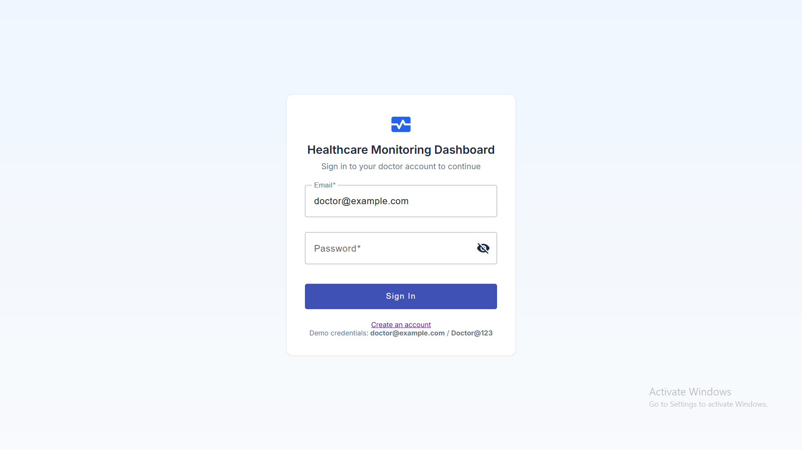
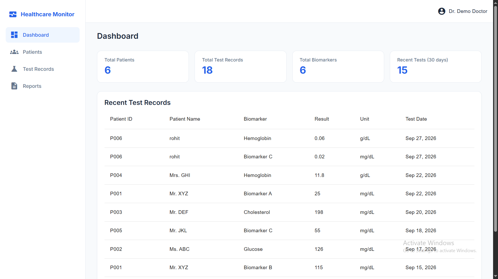
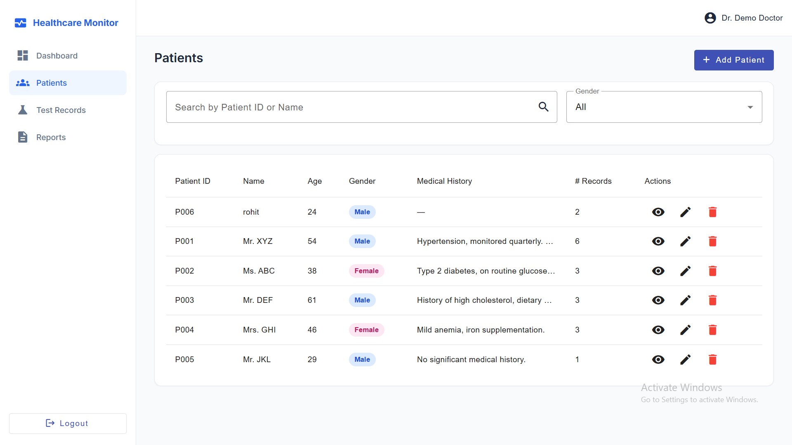
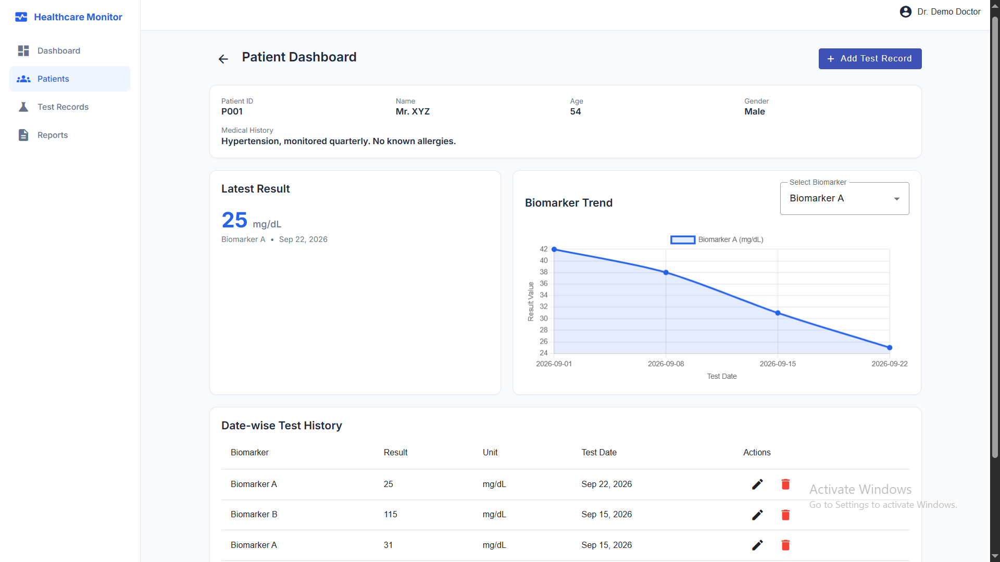
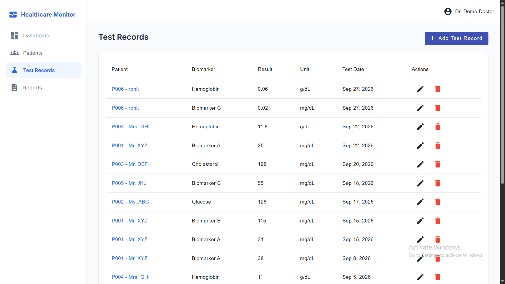
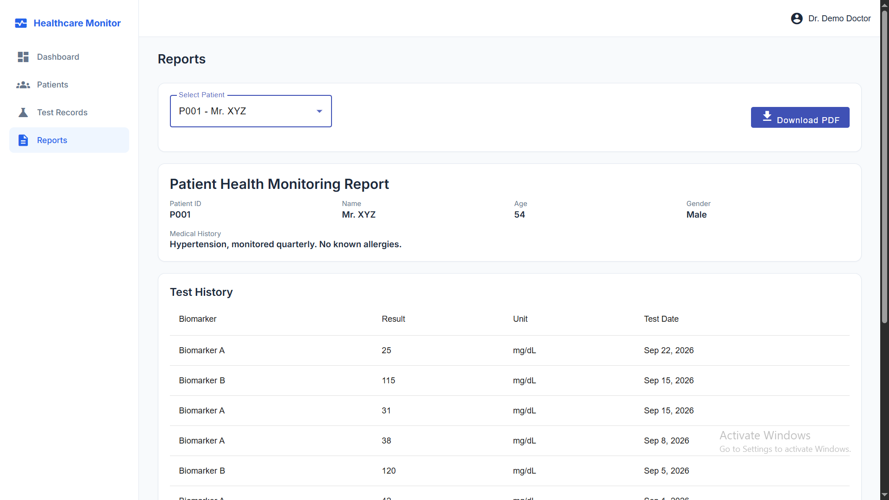

# Healthcare Monitoring Dashboard

A full-stack web app for doctors to manage patients, record biomarker test results, view trends on a chart, and download a PDF report.

## Project Overview

**What it is :** A doctor-facing dashboard for tracking patients' lab-style test results (biomarkers such as Glucose, Cholesterol, Hemoglobin).

**Problem it solves :** Test results kept in spreadsheets or on paper are hard to search, hard to compare over time, and slow to turn into a report. This app stores everything in a database, shows each biomarker's trend on a line chart, and generates a PDF report in one click.


## Features

- Doctor registration and login (JWT + bcrypt)
- Patient management: add, view, edit, delete, search, filter by gender
- Test record management: add, edit, delete (multiple biomarkers per patient)
- Patient dashboard: patient details, latest result, full history, biomarker trend chart
- Dashboard with summary counts and recent tests
- Report page with PDF download (chart included)
- Swagger API docs at `/api-docs`

## Tech Stack

| Part | Technology |
|---|---|
| Frontend | Angular 18, TypeScript, Angular Material, Chart.js (ng2-charts), jsPDF |
| Backend | Node.js, Express, TypeScript |
| Database | MySQL (`mysql2`) |
| Auth | JWT, bcrypt |

## Project Structure

```
healthcare-monitoring-dashboard/
├── backend/
│   ├── database/        # schema.sql, seed.sql
│   ├── docs/            # openapi.yaml (Swagger)
│   └── src/
│       ├── config/  controllers/  middleware/  routes/
│       ├── services/  validators/  utils/  types/
│       ├── app.ts
│       └── server.ts
└── frontend/
    └── src/app/
        ├── core/        # services, guard, interceptor, models
        ├── features/    # auth, dashboard, patients, test-records, reports
        ├── layout/      # sidebar + header
        └── shared/      # reusable components
```
## Setup / Installation Instructions

### Prerequisites

- [Node.js](https://nodejs.org/) 18 or higher (includes npm)
- [MySQL](https://dev.mysql.com/downloads/) 8 or higher, installed and running
- Git

### Step 1 — Clone the repository

```bash
git clone https://github.com/sagargadave/MRX-HealthTech-Assignment.git
cd MRX-HealthTech-Assignment
```

### Step 2 — Backend setup

```bash
cd backend
npm install
```

Create your environment file from the template:

```bash
# macOS / Linux
cp .env.example .env

# Windows (Command Prompt)
copy .env.example .env
```

Open `backend/.env` and fill in your values:

```
DB_HOST=localhost
DB_PORT=3306
DB_USER=root
DB_PASSWORD=your_mysql_password
DB_NAME=healthcare_monitoring
JWT_SECRET=change_this_to_a_long_random_string
JWT_EXPIRES_IN=8h
PORT=4000
CLIENT_URL=http://localhost:4200
```

| Variable | Meaning |
|---|---|
| `DB_HOST`, `DB_PORT` | Where MySQL is running |
| `DB_USER`, `DB_PASSWORD` | Your MySQL login |
| `DB_NAME` | Database name (created automatically by the seed script) |
| `JWT_SECRET` | Secret used to sign login tokens — use a long random string |
| `JWT_EXPIRES_IN` | How long a login stays valid |
| `PORT` | Backend port |
| `CLIENT_URL` | Frontend address allowed by CORS |

Set up the database :

```bash
npm run seed
```

Start the backend:

```bash
npm run dev
```

You should see:

```
[database] MySQL connection successful
[server] Healthcare Monitoring Dashboard API listening on http://localhost:4000
```

### Step 3 — Frontend setup

Open a **second terminal**:

```bash
cd frontend
npm install
npm start
```

### Step 4 — Open the app

Go to **http://localhost:4200**

### Demo login

```
Email:    doctor@example.com
Password: Doctor@123
```

You can also create your own doctor account on the **Register** page (`/register`).

### Useful commands

| Folder | Command | Purpose |
|---|---|---|
| `backend` | `npm run seed` | Create database, tables, sample data, demo doctor |
| `backend` | `npm run dev` | Start API with auto-reload |
| `backend` | `npm run build` then `npm start` | Compile and run the API |
| `frontend` | `npm start` | Start the Angular dev server |
| `frontend` | `npm run build` | Production build |

---

## Database Setup

**Database:** MySQL, database name `healthcare_monitoring`.

### Option A — Automatic (recommended)

Make sure MySQL is running and `backend/.env` has the right credentials, then run from the `backend` folder:

```bash
npm run seed
```

This one command:

1. Runs `backend/database/schema.sql` — creates the database, all tables, foreign keys and indexes
2. Runs `backend/database/seed.sql` — inserts dummy biomarkers, patients and test records
3. Creates the demo doctor account with a **bcrypt-hashed** password

> Run the seed **once** on a fresh database. Re-running it will not break the schema, but it will insert the sample test records again (duplicates).

### Option B — Manual

```bash
mysql -u root -p < backend/database/schema.sql
mysql -u root -p < backend/database/seed.sql
```

The demo doctor is created only by `npm run seed` (its password must be hashed with bcrypt), so use Option A, or create an account on the Register page.

### Verify

```sql
USE healthcare_monitoring;
SHOW TABLES;          -- users, patients, biomarkers, test_records
SELECT * FROM patients;
```

## API Overview

All endpoints are under `/api`. Everything except login and register needs `Authorization: Bearer <token>`.

| Method | Endpoint | Purpose |
|---|---|---|
| POST | `/auth/register` | Register a doctor |
| POST | `/auth/login` | Login, returns JWT |
| GET | `/auth/me` | Current user |
| GET / POST | `/patients` | List (search/filter) / create patient |
| GET / PUT / DELETE | `/patients/:id` | Get / update / delete patient |
| GET / POST | `/patients/:id/tests` | List / add test records for a patient |
| GET | `/patients/:id/biomarkers` | Biomarkers with results for a patient |
| GET | `/patients/:id/trends/:biomarkerId` | Trend data for the chart |
| GET | `/patients/:id/report` | Report data |
| GET | `/biomarkers` | All biomarkers |
| GET | `/test-records` | All test records |
| PUT / DELETE | `/test-records/:id` | Update / delete a test record |
| GET | `/dashboard/stats` | Summary counts |
| GET | `/dashboard/recent-tests` | Recent test records |

Search and filter example: `GET /api/patients?search=P00&gender=Female`

## Screenshots

### Login



### Dashboard



### Patient Management



### Patient Details & Biomarker Trends



### Test Records



### Medical Report


